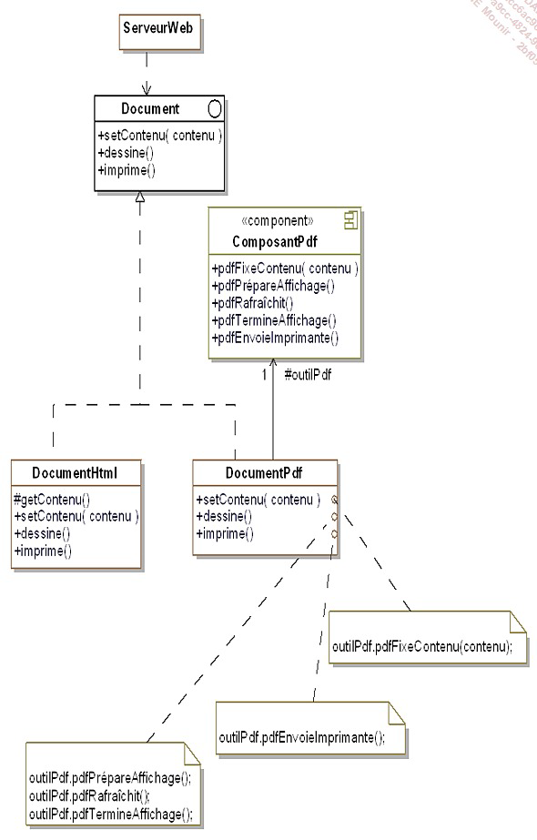
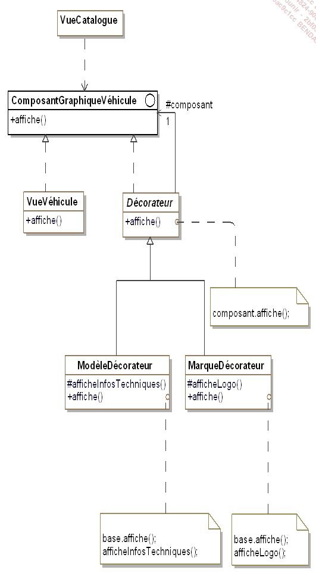
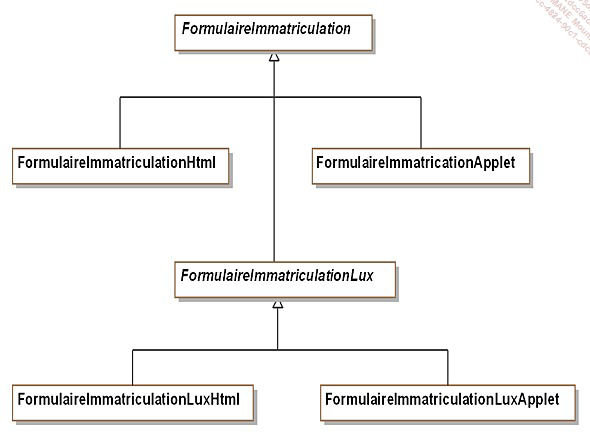
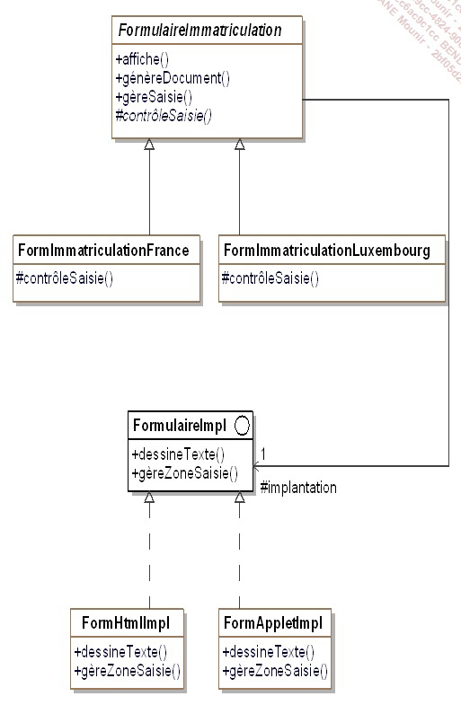
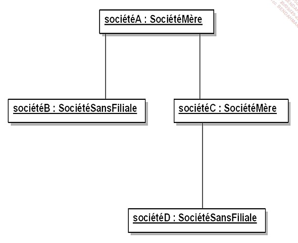
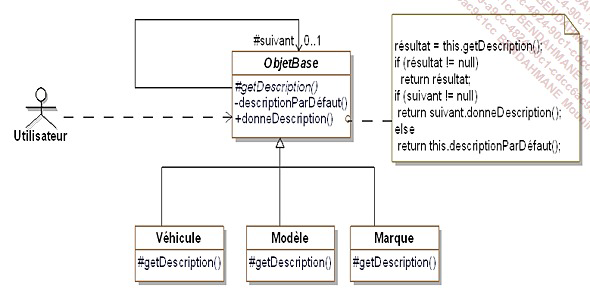
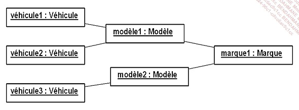
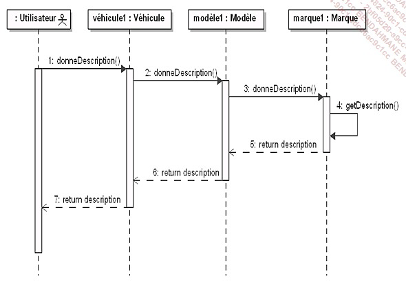
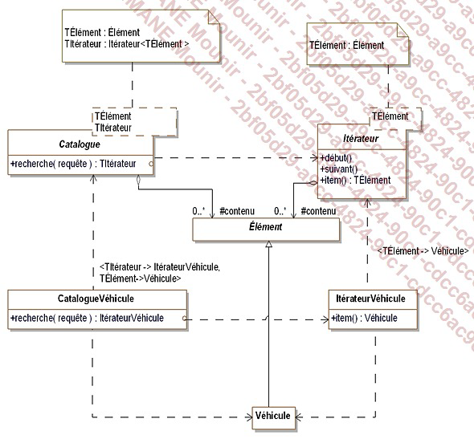
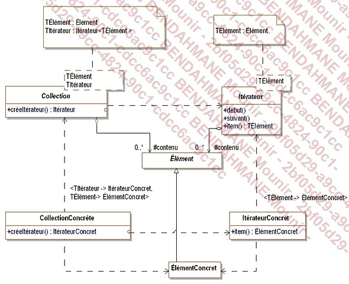

# Intro C#
## Création d'une application commande line   
`dotnet new console --framework net7.0`  
## Désactiver le `ImplicitUsings` dans le .csproj

## Ressources: 
- Design patterns, Gang of four
# Les patterns de construction
Les patterns de construction sont utilisés pour créer des objets.
L'objectif est d'abstraire le processus de création d'objets de leur usage.

## Abstract Factory
https://refactoring.guru/design-patterns/abstract-factory  

Le pattern Abstract Factory est un pattern de création qui fournit une interface pour créer des familles d'objets liés ou dépendants sans spécifier leurs classes concrètes.


```csharp
int nbAutos = 3;
int nbScooters = 2;
FabriqueVehicule fabrique;
Automobile[] autos = new Automobile[nbAutos];
Scooter[] scooters = new Scooter[nbScooters];
Console.WriteLine("Voulez-vous utiliser " +
    "des véhicules électriques (1) ou essence (2) :");
string choix = Console.ReadLine();
if (choix == "1")
{
    fabrique = new FabriqueVehiculeElectricite();
}
else
{
    fabrique = new FabriqueVehiculeEssence();
}
for (int index = 0; index < nbAutos; index++)
    autos[index] = fabrique.creeAutomobile("standard",
        "jaune", 6 + index, 3.2);
for (int index = 0; index < nbScooters; index++)
    scooters[index] = fabrique.creeScooter("classic",
        "rouge", 2 + index);
foreach (Automobile auto in autos)
    auto.afficheCaracteristiques();
foreach (Scooter scooter in scooters)
    scooter.afficheCaracteristiques();
```

##  Builder Pattern
https://refactoring.guru/design-patterns/builder  

Le pattern Builder est un pattern de création qui permet de séparer la construction d'un objet complexe de sa représentation afin que le même processus de construction puisse créer différentes représentations.


```csharp
ConstructeurLiasseVehicule constructeur;
Console.WriteLine("Voulez-vous construire des liasses HTML (1) ou PDF (2) :");
string choix = Console.ReadLine();
if (choix == "1")
{
    constructeur = new ConstructeurLiasseVehiculeHtml();
}
else
{
    constructeur = new ConstructeurLiasseVehiculePdf();
}
Vendeur vendeur = new Vendeur(constructeur);
Liasse liasse = vendeur.construit("Martin");
liasse.imprime();
```

## Factory Method
https://refactoring.guru/design-patterns/factory-method

Le pattern Factory Method est un pattern de création qui définit une interface pour créer un objet, mais délègue le choix de la classe concrète à utiliser à des sous-classes.

Le but de ce pattern est d'introduire une methode abstraite de création d'objet en la reportant aux sous classes concretes.

 

```csharp	
Client client;
client = new ClientComptant();
client.nouvelleCommande(2000.0);
client.nouvelleCommande(10000.0);
client = new ClientCredit();
client.nouvelleCommande(2000.0);
client.nouvelleCommande(10000.0);
```

## Singleton
https://refactoring.guru/design-patterns/singleton  

Le pattern Singleton est un pattern de création qui garantit qu'une classe n'a qu'une seule instance et fournit un point d'accès global à cette instance.

Il faut s'assurer de deux choses lorsqu'on veut mettre en place ce pattern : 
- une classe ne doit posseder qu'une seule instance
- il faut fournir une method de classe qui permette d'acceder a l'instance unique de la classe
```csharp
static void Main(string[] args)
 {
   // initialisation du vendeur du système
   Vendeur leVendeur = Vendeur.Instance();
   leVendeur.nom = "Vendeur Auto";
   leVendeur.adresse = "Paris";
   leVendeur.email = "vendeur@vendeur.com";
   // affichage du vendeur du système
   affiche();
 }

public static void affiche()
 {
   Vendeur leVendeur = Vendeur.Instance();
   leVendeur.affiche();
 }
```

## Prototype
https://refactoring.guru/design-patterns/prototype 

Le pattern Prototype est un pattern de création qui spécifie les types d'objets à créer à l'aide d'un prototype d'instance et crée de nouveaux objets en copiant ce prototype.

Le but de ce pattern est de créer de nouveaux objets en dupliquant des objets existants appeles "prototypes". C'est derniers disposent d'une capacite de clonage.


```csharp	
LiasseVierge liasseVierge = LiasseVierge.Instance();
liasseVierge.ajoute(new BonDeCommande());
liasseVierge.ajoute(new CertificatCession());
liasseVierge.ajoute(new DemandeImmatriculation());
// création d'une nouvelle liasse pour deux clients
LiasseClient liasseClient1 = new LiasseClient(
    "Martin");
LiasseClient liasseClient2 = new LiasseClient(
    "Durant");
liasseClient1.affiche();
liasseClient2.affiche();
```	
# Les patterns de structuration
L’objectif des patterns de structuration est de faciliter l’indépendance de l’interface d’un objet ou d’un
ensemble d’objets vis-à-vis de son implantation. Dans le cas d’un ensemble d’objets, il s’agit aussi de
rendre cette interface indépendante de la hiérarchie des classes et de la composition des objets.
En fournissant les interfaces, les patterns de structuration encapsulent la composition des objets,
augmentant le niveau d’abstraction du système à l’image des patterns de création qui encapsulent la
création des objets. Les patterns de structuration mettent en avant les interfaces.
L’encapsulation de la composition est réalisée non pas en structurant l’objet lui-même mais en transférant
cette structuration à un second objet. Celui-ci est intimement lié au premier objet. Ce transfert de
structuration signifie que le premier objet détient l’interface vis-à-vis des clients et gère la relation avec le
second objet qui lui gère la composition et n’a aucune interface avec les clients externes.

## Adapter
https://refactoring.guru/design-patterns/adapter

Le pattern Adapter est un pattern de structuration qui permet à des objets d'interfaces incompatibles de collaborer.

Le but de ce pattern est de faire collaborer des objets dont les interfaces sont incompatibles. Il s'agit de faire en sorte que des objets qui ne pourraient pas collaborer puissent le faire en utilisant un objet intermediaire qui joue le role d'adaptateur.



## Decorator
https://refactoring.guru/design-patterns/decorator

Le pattern Decorator est un pattern de structuration qui permet d'ajouter dynamiquement des fonctionnalités à un objet.

Ici, on cherche a ajouter des fonctionnalités suplémentaire a un objet en prenant soin de ne pas modifier son interface. Toutes modifications apportées par ce pattern sereont transparente vis a vis des clients.

Ce pattern constitue une alternative a l'heritage.



## Bridge
https://refactoring.guru/design-patterns/bridge

Le pattern Bridge est un pattern de structuration qui permet de découpler une abstraction de son implémentation afin que les deux puissent varier indépendamment.




```csharp
FormImmatriculationLuxembourg formulaire1 = new
    FormImmatriculationLuxembourg(new FormHtmlImpl());
formulaire1.affiche();
if (formulaire1.gereSaisie())
    formulaire1.genereDocument();
Console.WriteLine();
FormImmatriculationFrance formulaire2 = new
    FormImmatriculationFrance(new FormAppletImpl());
formulaire2.affiche();
if (formulaire2.gereSaisie())
    formulaire2.genereDocument();
```

## Composite
https://refactoring.guru/design-patterns/composite

Le pattern Composite est un pattern de structuration qui permet de traiter un groupe d'objets de la même manière qu'un objet unique.

L'idée est de traiter ses objects comme un arbre. Ainsi, lorsque que l'on applique une methode a un noeud, celle-ci est appliquée a tous les noeuds fils simplement.

Au sein de notre système de vente de véhicules, nous voulons représenter les sociétés clientes,
notamment pour connaître le nombre de véhicules dont elles disposent et leur proposer des offres de
maintenance de leur parc.
Les sociétés qui possèdent des filiales demandent des offres de maintenance qui prennent en compte le
parc de véhicules de leurs filiales.
Une solution immédiate consiste à traiter différemment les sociétés sans filiale et celles possédant des
filiales. Cependant cette différence de traitement entre les deux types de société rend l’application plus
complexe et dépendante de la composition interne des sociétés clientes.
Le pattern résout ce problème en unifiant l’interface des deux types de sociétés et en
utilisant la composition récursive. Cette composition récursive est nécessaire car une société peut
posséder des filiales qui possèdent elles-mêmes d’autres filiales.



```csharp	
Societe societe1 = new SocieteSansFiliale();
societe1.ajouteVehicule();
Societe societe2 = new SocieteSansFiliale();
societe2.ajouteVehicule();
societe2.ajouteVehicule();
Societe groupe = new SocieteMere();
groupe.ajouteFiliale(societe1);
groupe.ajouteFiliale(societe2);
groupe.ajouteVehicule();
Console.WriteLine("Cout d'entretien total du groupe : " +
groupe.calculeCoutEntretien());
```
# Les patterns de comportement
L’objectif des patterns de comportement est de faciliter la communication entre les objets en définissant

## Chain of Responsibility
https://refactoring.guru/design-patterns/chain-of-responsibility

Le pattern Chain of Responsibility est un pattern de comportement qui permet de passer une requête entre une chaîne d'objets.

Le but de ce pattern est de permettre à plus d'un objet de pouvoir traiter une requête. Pour cela, on va créer une chaîne d'objets qui vont chacun traiter la requête. Si un objet ne peut pas traiter la requête, il va la passer à l'objet suivant de la chaîne.





```csharp
ObjetBase vehicule1 = new Vehicule(
    "Auto++ KT500 Véhicule d'occasion en bon état ");
Console.WriteLine(vehicule1.donneDescription());
ObjetBase modele1 = new Modele("KT400", 
    "Le véhicule spacieux et confortable");
ObjetBase vehicule2 = new Vehicule(null);
vehicule2.suivant = modele1;
Console.WriteLine(vehicule2.donneDescription());
ObjetBase marque1 = new Marque("Auto++", 
    "La marque des autos", "de grande qualité");
ObjetBase modele2 = new Modele("KT700", null);
modele2.suivant = marque1;
ObjetBase vehicule3 = new Vehicule(null);
vehicule3.suivant = modele2;
Console.WriteLine(vehicule3.donneDescription());
ObjetBase vehicule4 = new Vehicule(null);
Console.WriteLine(vehicule4.donneDescription());
```

## Iterator
https://refactoring.guru/design-patterns/iterator

Le pattern Iterator est un pattern de comportement qui permet d'accéder aux éléments d'un objet de manière séquentielle sans exposer sa représentation sous-jacente.




```csharp
CatalogueVehicule catalogue = new CatalogueVehicule();
IterateurVehicule iterateur = catalogue.recherche(
      "bon marché");
Vehicule vehicule;
iterateur.debut();
vehicule = iterateur.item();
while (vehicule != null)
{
    vehicule.affiche();
    iterateur.suivant();
    vehicule = iterateur.item();
}
```


# Projet
Gestion d'un magasin de musique

le projet a rendre se situe dans le dossier [Projet](./Projet/Program.cs)
## Patterns
- Builder : Dossier builder pour créer des instruments par catégorie (Guitare/Piano ou Electrique/Acoustique)
- Abstract Factory : Alimentation du stock, dossier factory
- Factory Method : Choix de la factory dans le main
- Prototype : StockVierge a alimenter pour construire des stocks, Lors de la création d'un magasin, on clone le stock vierge pour avoir un stock de départ
- Singleton : StockeVierge est un singleton
- Adapter : On utilise le AcousticAdapter pour ecouter un instrument electrique en le branchant
- Composite : Arbre de magasin avec magasin mere et filliale
- Iterator : Utilisation d'un iterateur catalogue qui permet de filter les instruments par prix