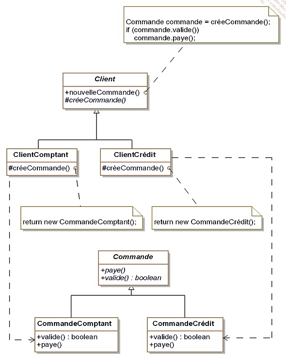
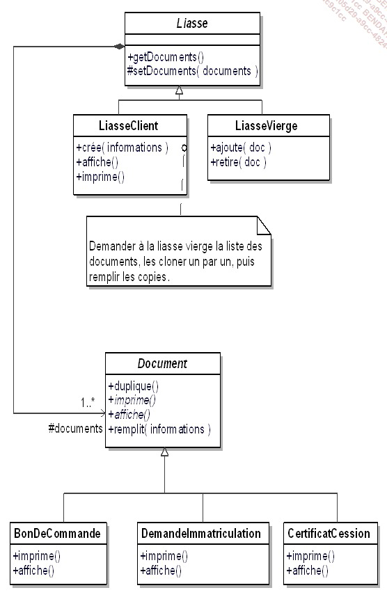

# Intro C#
## Création d'une application commande line   
`dotnet new console --framework net7.0`  
## Désactiver le `ImplicitUsings` dans le .csproj

## Ressources: 
- Design patterns, Gang of four
# Les patterns de construction
Les patterns de construction sont utilisés pour créer des objets.
L'objectif est d'abstraire le processus de création d'objets de leur usage.

## Abstract Factory
Le pattern Abstract Factory est un pattern de création qui fournit une interface pour créer des familles d'objets liés ou dépendants sans spécifier leurs classes concrètes.


```csharp
int nbAutos = 3;
int nbScooters = 2;
FabriqueVehicule fabrique;
Automobile[] autos = new Automobile[nbAutos];
Scooter[] scooters = new Scooter[nbScooters];
Console.WriteLine("Voulez-vous utiliser " +
    "des véhicules électriques (1) ou essence (2) :");
string choix = Console.ReadLine();
if (choix == "1")
{
    fabrique = new FabriqueVehiculeElectricite();
}
else
{
    fabrique = new FabriqueVehiculeEssence();
}
for (int index = 0; index < nbAutos; index++)
    autos[index] = fabrique.creeAutomobile("standard",
        "jaune", 6 + index, 3.2);
for (int index = 0; index < nbScooters; index++)
    scooters[index] = fabrique.creeScooter("classic",
        "rouge", 2 + index);
foreach (Automobile auto in autos)
    auto.afficheCaracteristiques();
foreach (Scooter scooter in scooters)
    scooter.afficheCaracteristiques();
```

##  Builder Pattern
Le pattern Builder est un pattern de création qui permet de séparer la construction d'un objet complexe de sa représentation afin que le même processus de construction puisse créer différentes représentations.


```csharp
ConstructeurLiasseVehicule constructeur;
Console.WriteLine("Voulez-vous construire des liasses HTML (1) ou PDF (2) :");
string choix = Console.ReadLine();
if (choix == "1")
{
    constructeur = new ConstructeurLiasseVehiculeHtml();
}
else
{
    constructeur = new ConstructeurLiasseVehiculePdf();
}
Vendeur vendeur = new Vendeur(constructeur);
Liasse liasse = vendeur.construit("Martin");
liasse.imprime();
```

## Factory Method
Le pattern Factory Method est un pattern de création qui définit une interface pour créer un objet, mais délègue le choix de la classe concrète à utiliser à des sous-classes.

Le but de ce pattern est d'introduire une methode abstraite de création d'objet en la reportant aux sous classes concretes.

 

```csharp	
Client client;
client = new ClientComptant();
client.nouvelleCommande(2000.0);
client.nouvelleCommande(10000.0);
client = new ClientCredit();
client.nouvelleCommande(2000.0);
client.nouvelleCommande(10000.0);
```

## Singleton
Le pattern Singleton est un pattern de création qui garantit qu'une classe n'a qu'une seule instance et fournit un point d'accès global à cette instance.

Il faut s'assurer de deux choses lorsqu'on veut mettre en place ce pattern : 
- une classe ne doit posseder qu'une seule instance
- il faut fournir une method de classe qui permette d'acceder a l'instance unique de la classe
```csharp
static void Main(string[] args)
 {
   // initialisation du vendeur du système
   Vendeur leVendeur = Vendeur.Instance();
   leVendeur.nom = "Vendeur Auto";
   leVendeur.adresse = "Paris";
   leVendeur.email = "vendeur@vendeur.com";
   // affichage du vendeur du système
   affiche();
 }

public static void affiche()
 {
   Vendeur leVendeur = Vendeur.Instance();
   leVendeur.affiche();
 }
```

## Prototype
Le pattern Prototype est un pattern de création qui spécifie les types d'objets à créer à l'aide d'un prototype d'instance et crée de nouveaux objets en copiant ce prototype.

Le but de ce pattern est de créer de nouveaux objets en dupliquant des objets existants appeles "prototypes". C'est derniers disposent d'une capacite de clonage.

